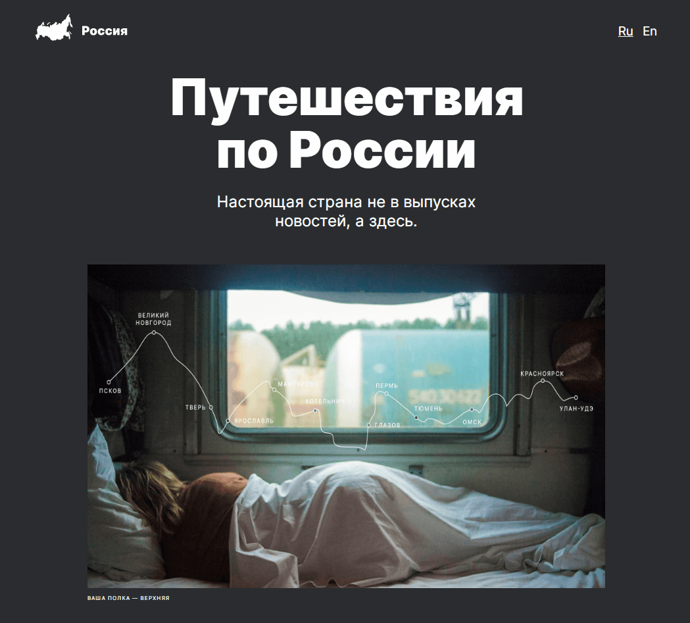

# Проект: [Путешествие по России](https://voitekhovich.github.io/russian-travel/)

## Описание

Учебный проект [Яндекс практикум](https://practicum.yandex.ru/) по курсу "Адаптивная вёрстка и работа с макетом".

## Используемые технологии

* HTML CSS
* флексбокс-вёрстка
* grid layout
* медиазапросы
* Адаптивная вёрстка по [макету в Figma](https://www.figma.com/file/5S2WSbEFL6awjVWJ0NWL8Q/Sprint-3_-Russia-_-desktop-mobile?node-id=28503%3A0)
* Структура кода по [методолотгии БЭМ](https://ru.bem.info/methodology/)
* [Оптимизация картинок](https://tinypng.com/)

## GitHub Pages
https://voitekhovich.github.io/russian-travel/
